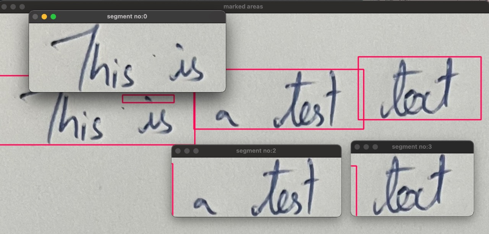
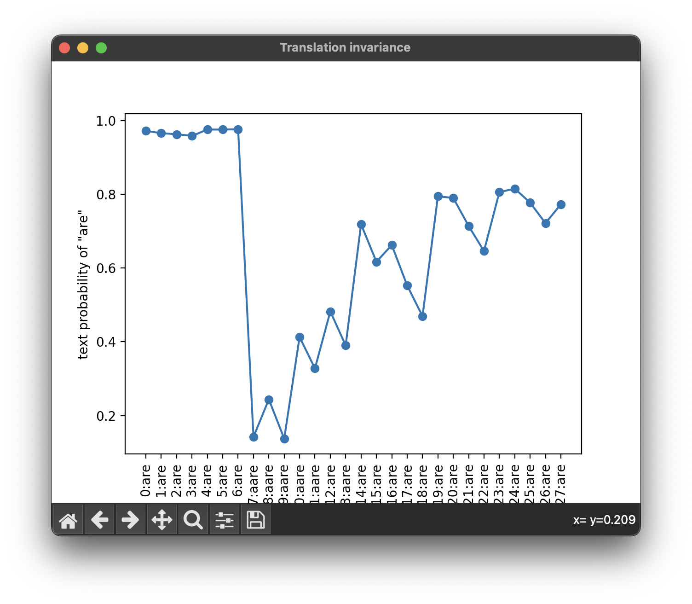
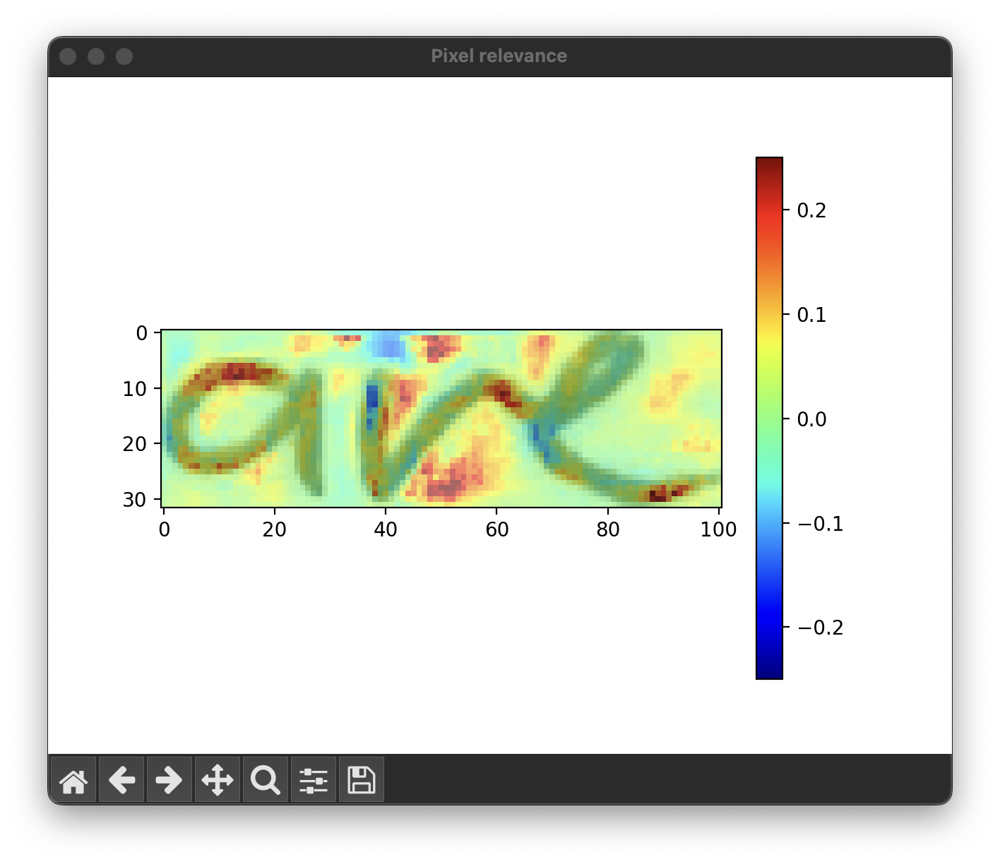
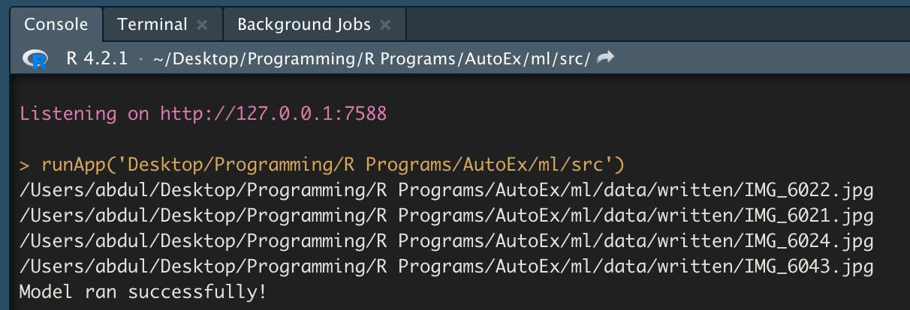
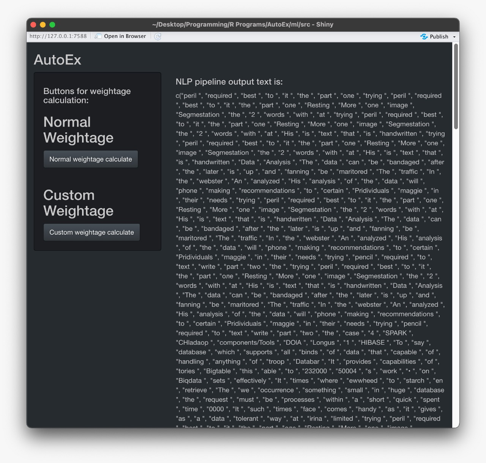
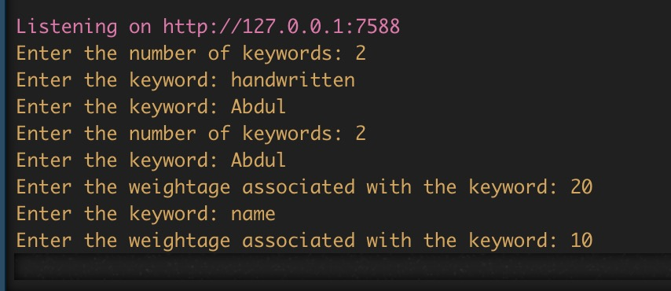
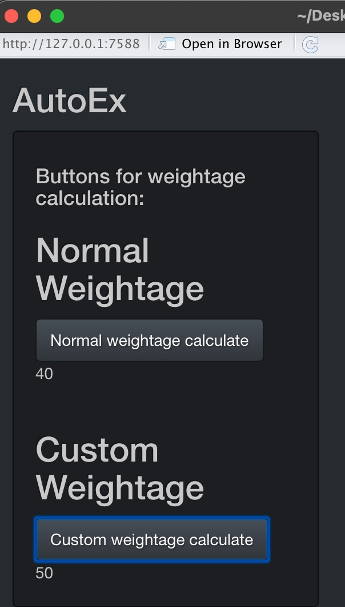
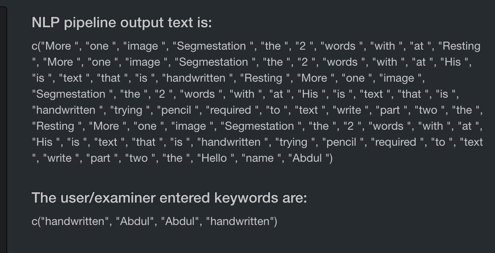
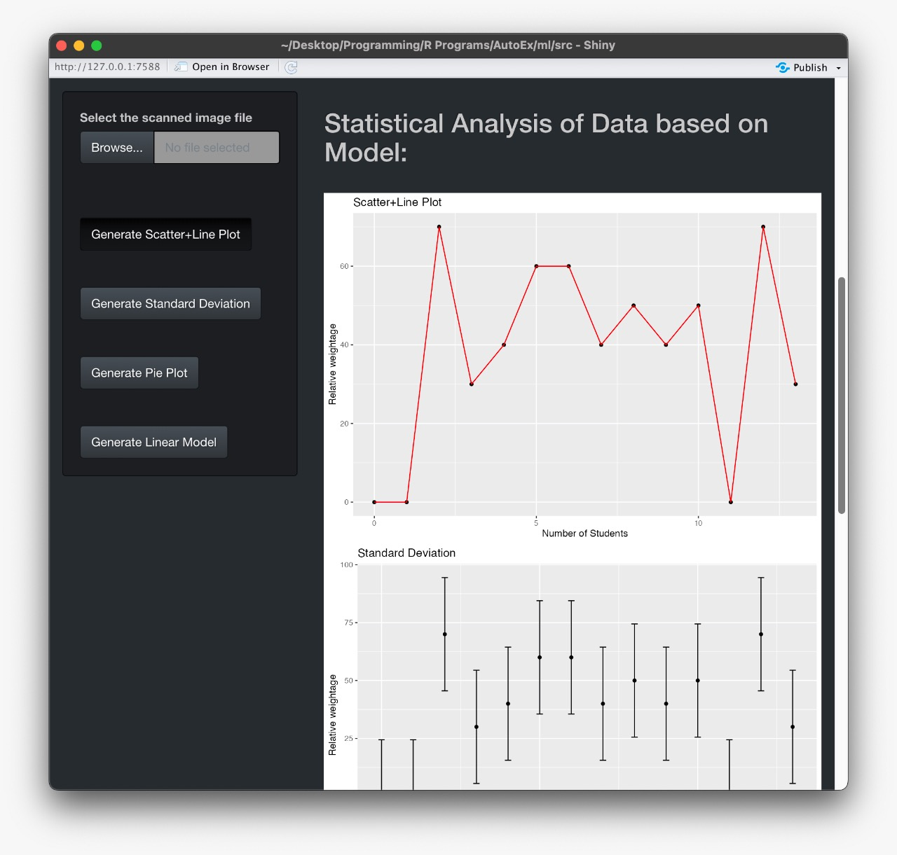
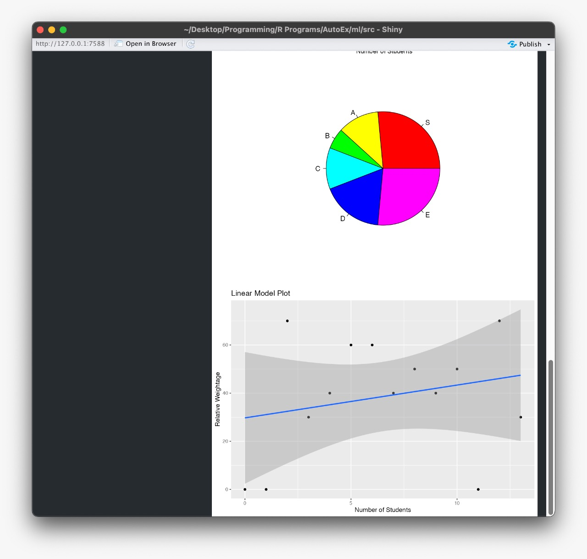

# Automated Examiner
## A tool to automate the process of correcting a handwritten answer sheet.

This tool uses handwritten text detection trained using CNN, RNN and CTC loss function. The model is trained on the IAM dataset. The model is trained using tensorflow and keras. 

The model is used to extract the text from the image and the extracted text is sent to a NLP pipeline to correct the spelling errors. The corrected text is then compared with the correct answer key. The score is calculated and displayed.

We use Apple's Vision Kit interfaced with Python using the objective c wrapper to detect and store the handwritten text data on top of the trained model to increase the accuracy of the text detected to ensure proper gradings.

The tool is built using Python and the GUI is built using R Shiny.

## Creating the dataset
To create the IAM dataset, we used the words IAM dataset available on the internet. The dataset contains images of handwritten text. The dataset is divided into 3 parts: train, test and validation. The train and validation set contains the images and the corresponding text. The test set contains only the images. The text for the test set is not available. We used the train and validation set to train the model and the test set to test the model.

## Training the model
To train the model, we used the train and validation set. The images are converted to grayscale and resized to 128x32. The text is converted to a sequence of integers. The model is trained using the Adam optimizer and the CTC loss function. The model is trained for 10 epochs. The model is saved after training.

## Testing the model
To test the model, we used the test set. The images are converted to grayscale and resized to 128x32. The text is converted to a sequence of integers. The model is loaded and the images are passed through the model. The output of the model is a sequence of integers. The sequence of integers is converted to a sequence of characters. The sequence of characters is compared with the correct text. The accuracy is calculated.

## Creating the GUI
To create the GUI, we used R Shiny. The GUI contains 3 tabs: Home, Upload and Results. The Home tab contains the instructions to use the tool. The Upload tab contains the upload button to upload the image. The Results tab contains the results of the image uploaded.

## Images of the GUI

## Installation
1. Clone the repository
2. Run `pip install -r requirements.txt`
3. Navigate to the ml/src directory and run `python main.py`
4. Drop the image of the answer sheet in the ml/data/writings directory
5. To run the GUI, run `app.R`

## Usage
1. The GUI will open up. Click on the "Browse" button to select the image of the answer sheet.
2. Choose the method of awarding marks, custom weightage or default weightage for the keywords.
3. Click on the "Submit" button to get the score.
4. The score will be displayed on the screen. 
5. The class average score will be displayed on the screen, alongside the score of the student.

This project is a part of the course project for the course CSE4082, at VIT University, Chennai.

## Contributors
1. Abdul A.
2. Samik S.

